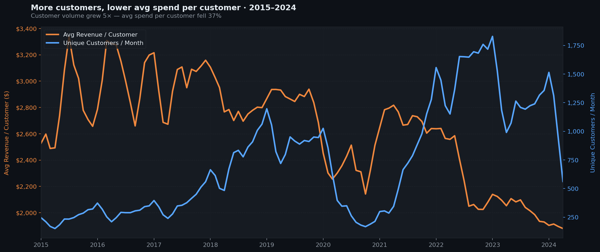
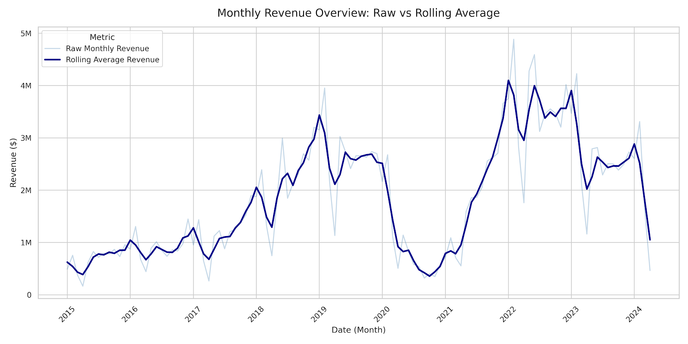
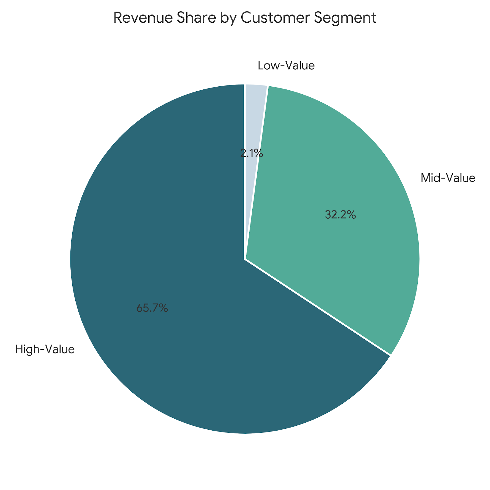
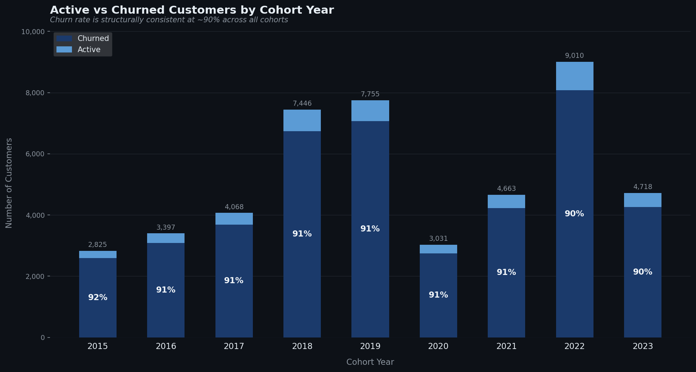
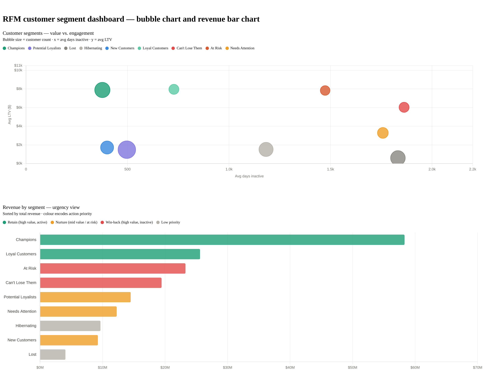
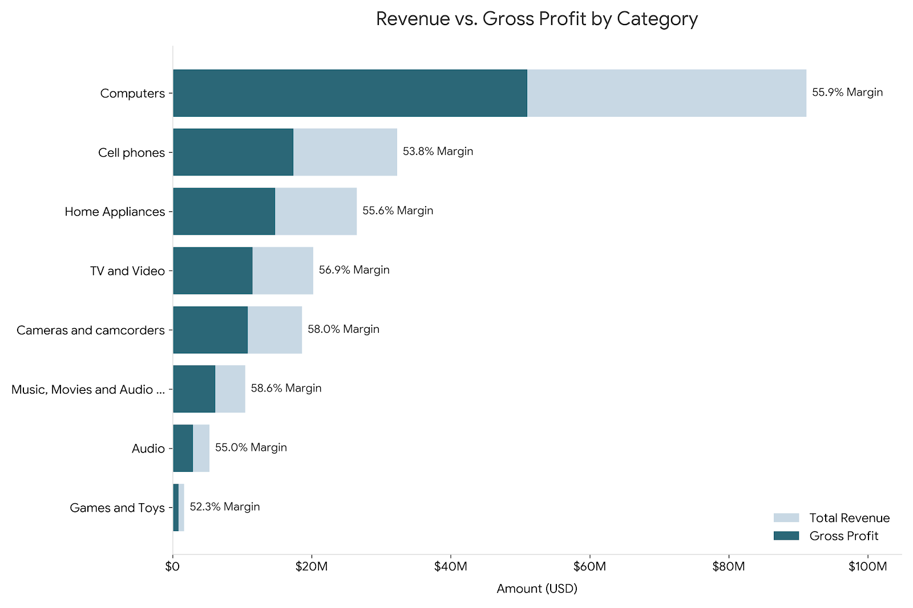
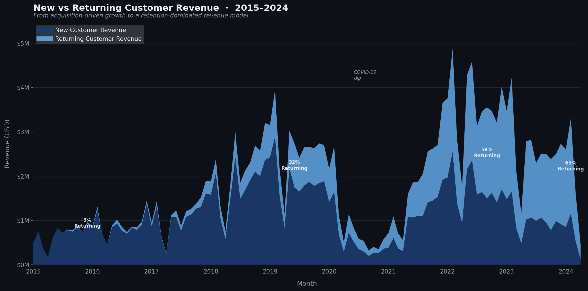

# Customer Analytics — SQL Cohort & RFM Analysis

An end-to-end customer analytics project built in PostgreSQL, analysing **~100,000 customers** and **200,000 transactions** spanning **2015–2024**. The project covers revenue trends, cohort retention, RFM segmentation, product performance, and churn analysis — structured as a series of eight progressively complex SQL queries built on top of a single reusable view.

---

## Table of Contents

- [Dataset](#dataset)
- [Project Structure](#project-structure)
- [Analysis Overview](#analysis-overview)
  - [1. Cohort View](#1-cohort-view-foundation)
  - [2. Monthly Revenue & Customer Trends](#2-monthly-revenue--customer-trends)
  - [3. 3-Month Rolling Averages](#3-3-month-rolling-averages)
  - [4. Customer LTV Segmentation](#4-customer-ltv-segmentation)
  - [5. Active vs Churned Customers](#5-active-vs-churned-customers)
  - [6. RFM Segmentation](#6-rfm-segmentation)
  - [7. Product Category Analysis](#7-product-category-analysis)
  - [8. New vs Returning Customers](#8-new-vs-returning-customers)
- [Key Findings](#key-findings)
- [Technical Notes](#technical-notes)
- [Acknowledgements](#acknowledgements)

---

## Dataset

This project uses the **Contoso 100K** dataset — a fictional retail dataset simulating a global electronics retailer operating across multiple currencies and geographies.

| Table | Rows | Description |
|---|---|---|
| `sales` | ~200,000 | Order-level transactions with pricing, quantity, currency |
| `customer` | ~105,000 | Customer demographics and location |
| `product` | 2,517 | Product catalogue with categories and costs |
| `store` | 74 | Store metadata including online channel |
| `date` | 3,653 |  Date dimension with year, quarter, month, day-of-week and working day flags |
| `currencyexchange` | ~91,000 | Daily exchange rates (AUD, CAD, EUR, GBP, USD) |

> All revenue figures are normalised to USD using daily exchange rates via `quantity * netprice / exchangerate`.

---

## Project Structure

```
├── 1_View.sql                        # Base cohort view
├── 2_Monthly_Revenue_Customer_Trends.sql
├── 3_Three_Month_Rolling_Average.sql
├── 4_Segmentation.sql
├── 5_Active_vs_Churned.sql
├── 6_RFM_Segmentation.sql
├── 7_Product_Analysis.sql
└── 8_New_vs_Returning.sql
```

All queries build on the `cohort_analysis` view defined in `1_View.sql`, which serves as the single source of truth for customer-level revenue aggregation and cohort year assignment.

---

## Analysis Overview

### 1. Cohort View — Foundation

**File:** `1_View.sql`

Creates a reusable PostgreSQL view that aggregates raw sales data to `customerkey + orderdate` grain, enriches it with customer demographics, and computes each customer's `first_purchase_date` and `cohort_year` using a window function.

```sql
MIN(cr.orderdate) OVER (PARTITION BY cr.customerkey) AS first_purchase_date,
EXTRACT(YEAR FROM MIN(cr.orderdate) OVER (PARTITION BY cr.customerkey)) AS cohort_year
```

This view is the foundation for all subsequent queries — avoiding repeated joins and aggregations across eight analyses.

---

### 2. Monthly Revenue & Customer Trends

**File:** `2_Monthly_Revenue_Customer_Trends.sql`

Monthly breakdown of total revenue, unique customers, and average revenue per customer.





---

### 3. 3-Month Rolling Averages

**File:** `3_Three_Month_Rolling_Average.sql`

Smooths monthly volatility using a **centred 3-month window** (`1 PRECEDING AND 1 FOLLOWING`) to better expose underlying trends in revenue, customer count, and revenue per customer.

```sql
AVG(tr) OVER(ORDER BY ym ROWS BETWEEN 1 PRECEDING AND 1 FOLLOWING) AS rolling_avg_revenue
```





---

### 4. Customer LTV Segmentation

**File:** `4_Segmentation.sql`

Segments all customers into three value tiers based on IQR (Q1/Q3 percentile boundaries of lifetime revenue).

| Segment | Customers | Avg LTV | % of Total Revenue |
|---|---|---|---|
| 3 - High-Value | 12,372 | $10,961 | 65.7% |
| 2 - Mid-Value | 24,743 | $2,682 | 32.2% |
| 1 - Low-Value | 12,372 | $347 | 2.1% |



---

### 5. Active vs Churned Customers

**File:** `5_Active_vs_Churned.sql`

Classifies customers as **Active** or **Churned** based on whether their last purchase falls within the 6-month window prior to the dataset's end date (2024-04-20).

> **Note:** Customers whose first purchase falls within the last 6 months (~5.2% of all customers) are intentionally excluded from this analysis as they have not had sufficient time to be evaluated for churn.



---

### 6. RFM Segmentation

**File:** `6_RFM_Segmentation.sql` (The file includes detailed comments describing the reasoning and methodology used for the analysis)

Scores each customer on three dimensions using NTILE(5) quintiles, then maps score combinations to 9 business segments.

| Dimension | Definition | Scoring |
|---|---|---|
| **Recency** | Days since last purchase | Fewer days = better → `6 - NTILE(5) OVER (ORDER BY days_since ASC)` |
| **Frequency** | Distinct purchase days | More = better → `NTILE(5) OVER (ORDER BY frequency ASC)` |
| **Monetary** | Total lifetime revenue | Higher = better → `NTILE(5) OVER (ORDER BY monetary ASC)` |

**Results:**

| Segment | Customers | % | Avg LTV | Avg Days Inactive |
|---|---|---|---|---|
| Champions | 7,492 | 15.1% | $9,100 | 265 |
| Potential Loyalists | 9,883 | 20.0% | $1,717 | 404 |
| Lost | 6,912 | 14.0% | $687 | 1,945 |
| Hibernating | 6,458 | 13.0% | $1,751 | 1,195 |
| New Customers | 5,451 | 11.0% | $1,985 | 291 |
| Loyal Customers | 3,256 | 6.6% | $9,191 | 671 |
| Can't Lose Them | 3,263 | 6.6% | $6,971 | 1,981 |
| At Risk | 3,003 | 6.1% | $9,066 | 1,532 |
| Needs Attention | 3,769 | 7.6% | $3,806 | 1,861 |

> **Note:** 265 avg days inactive for Champions may seem high, but it reflects the relative scoring via NTILE. Within a 9-year dataset where the majority of customers last purchased 3-5 years ago, 265 days places Champions firmly in the top recency quintile.



---

### 7. Product Category Analysis

**File:** `7_Product_Analysis.sql`

Revenue, gross profit, and margin analysis by product category. Margin is calculated as a revenue-weighted average to avoid distortion from low-value line items.

```sql
ROUND(SUM(line_revenue - line_cost) * 100.0 / NULLIF(SUM(line_revenue), 0), 1) AS avg_margin_pct
```



---

### 8. New vs Returning Customer Trends

**File:** `8_New_vs_Returning.sql`

Classifies every customer-month as New (first purchase month) or Returning, tracking how the acquisition vs retention revenue mix evolved over time.

**Key trend:**



---

## Key Findings

**1.While the business successfully scaled its monthly unique customer base by 5x, it experienced a significant 37% drop in average spend per customer**
This trade-off suggests a major shift in the company's business model or market positioning. The business transitioned from a high-yield, low-volume model in 2015 (where fewer customers spent upwards of $3,200) to a high-volume, low-yield mass-market strategy by 2024 (where a much larger customer base spends closer to $1,900 each).

**2. Top 25% of customers generate 66% of all revenue**
LTV segmentation shows extreme revenue concentration. High-Value customers (top quartile by LTV) account for $135.6M of $206.3M total revenue. The bottom 25% generate just 2.1%.

**3. The business has a structural retention problem — or a structural one-purchase model**
Churn rate sits consistently at ~90% across every cohort year from 2015 to 2023. This is either a category-level behaviour (electronics are infrequent purchases) or a missed retention opportunity — the RFM data suggests both.

**4. Champions are high-value and still relatively recent**
After correcting for RFM scoring, Champions (R≥4 F≥4 M≥4) average 265 days inactive and $9,100 LTV — genuinely the best customers. At Risk customers (R≤2 F≥4 M≥4) have $9,066 LTV but 1,532 days inactive — equally valuable, but rapidly becoming unrecoverable.

**5. The business crossed 50% returning revenue in mid-2022**
New vs Returning analysis shows a structural inflection point in 2022 where returning customer revenue overtook new customer revenue for the first time. By early 2024, 67% of customers in any given month are returning — a significant maturation signal.

**6. Computers dominate revenue but not margin**
At 44.2% of total revenue, Computers are the revenue engine. However Music, Movies & Audio Books leads on gross margin at 58.6%, despite contributing only 5.1% of revenue — a potential underinvested category.

---

## Technical Notes

- **Database:** PostgreSQL 17
- **Tools Used:** pgAdmin 4, DBeaver, Visual Studio Code

---

## Dataset
**Contoso 100K** — a fictional retail dataset widely used for analytics practice and education.
