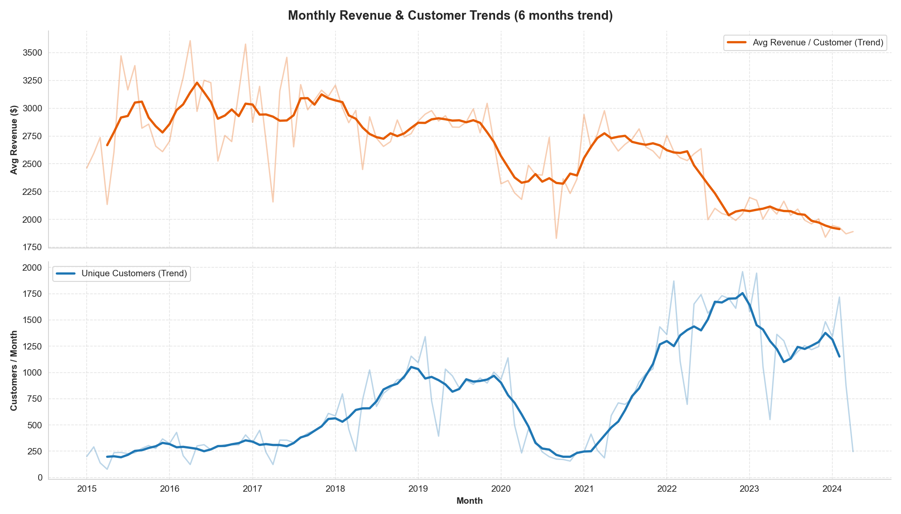
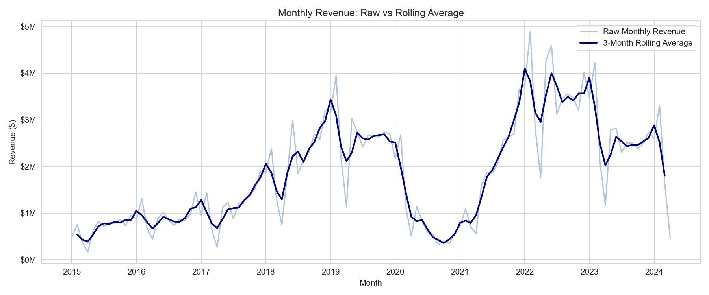
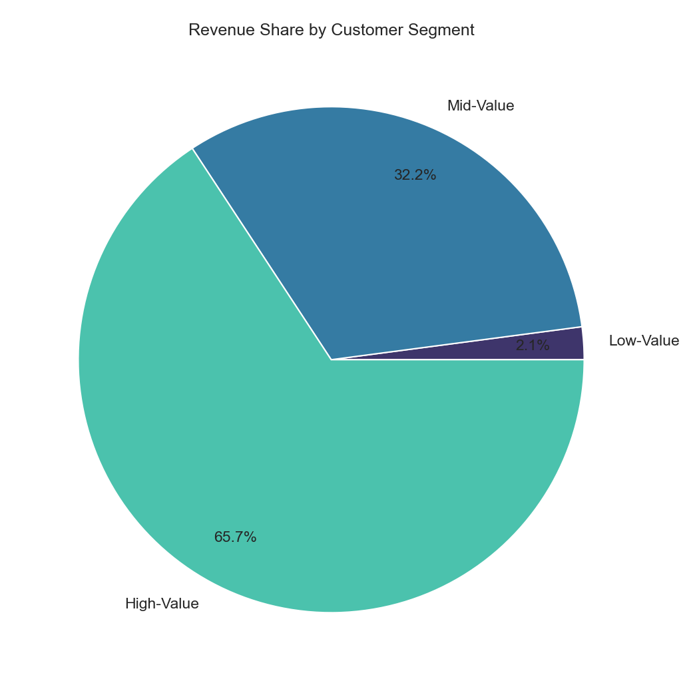
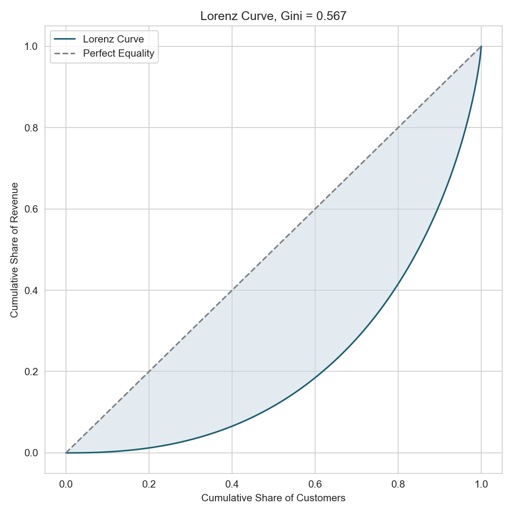
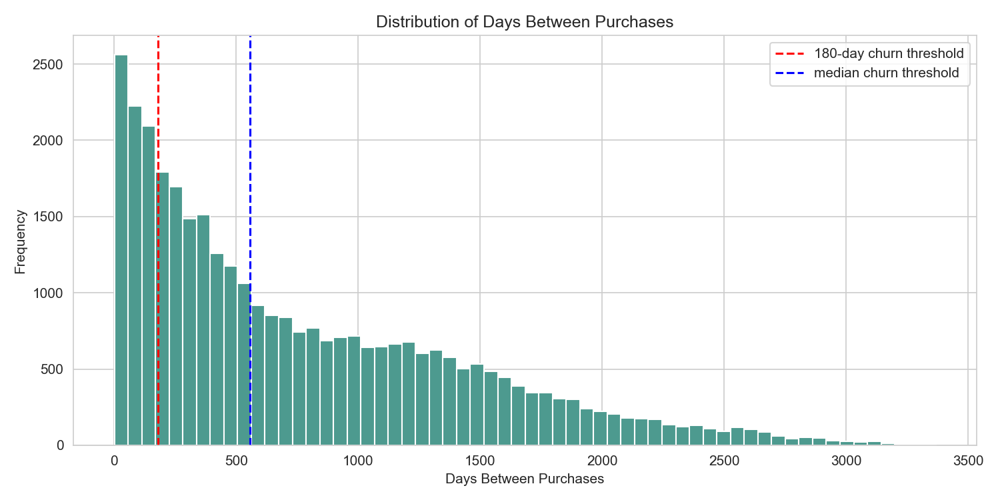
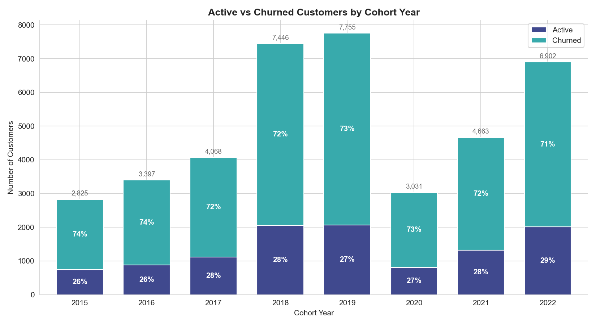
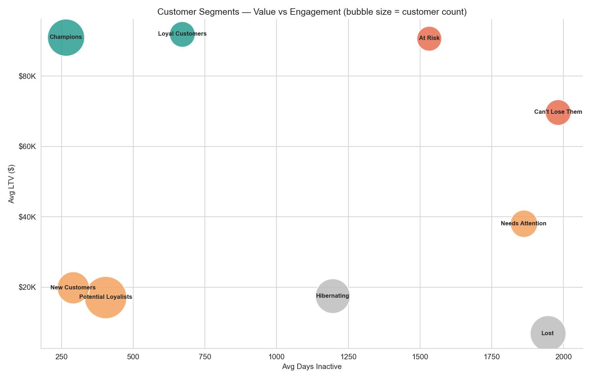
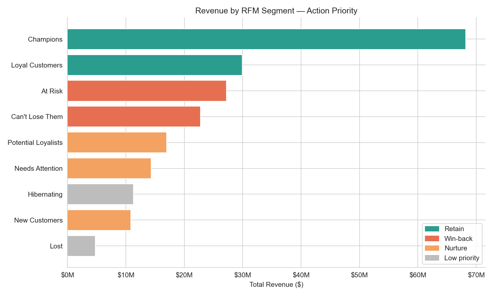
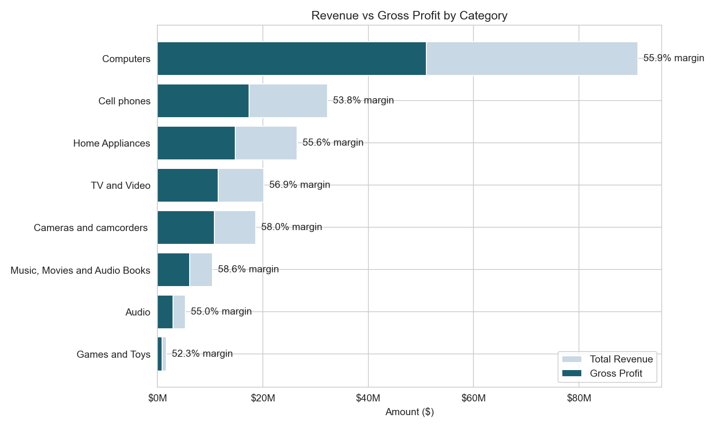
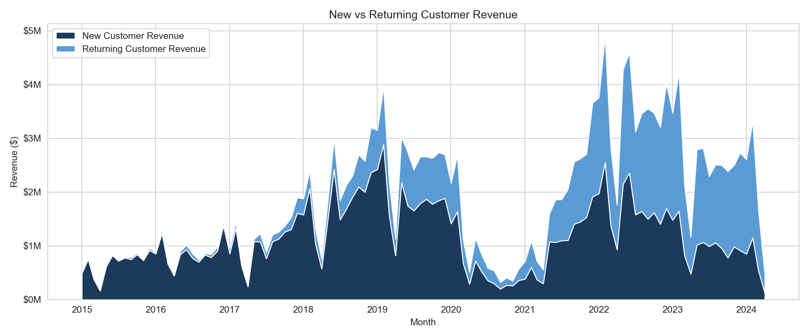

# Customer Analytics. SQL + Python

End-to-end customer analytics project on the Contoso 100K dataset (~100,000 customers, ~200,000 transactions, 2015-2024), a fictional electronics retailer. SQL builds the core metrics; Python validates them, recreates every chart from real code, and adds two statistical analyses that led to a methodology correction in the SQL layer.

## Project Structure

```
SQL/                           # 8 queries, built on one reusable view
├── 1_View.sql
├── 2_Monthly_Revenue_Customer_Trends.sql
├── 3_Three_Month_Rolling_Average.sql
├── 4_Segmentation.sql
├── 5_Active_vs_Churned.sql
├── 6_RFM_Segmentation.sql
├── 7_Product_Analysis.sql
└── 8_New_vs_Returning.sql

Python/
├── src/
│   ├── db_connection.py       # SQLAlchemy engine
│   └── queries.py             # SQL queries as reusable strings
├── notebooks/
│   ├── 1_data_validation.ipynb
│   ├── 2_visualizations.ipynb
│   └── 3_statistical_analysis.ipynb
└── requirements.txt

Images/
```

All queries read from `cohort_analysis`, a view aggregating raw sales to `customerkey + orderdate` grain and assigning each customer a cohort year based on their first purchase:

```sql
CREATE OR REPLACE VIEW cohort_analysis AS
SELECT
    cr.*,
    MIN(cr.orderdate) OVER (PARTITION BY cr.customerkey) AS first_purchase_date,
    EXTRACT(YEAR FROM MIN(cr.orderdate) OVER (PARTITION BY cr.customerkey)) AS cohort_year
FROM customer_revenue cr
```

Python never re-derives these metrics. It queries the same view and the same result sets, so SQL and Python stay consistent by construction.

---

## Analysis Overview

### 1. Monthly Revenue & Customer Trends
Monthly revenue, unique customers, and average revenue per customer, recreated in `matplotlib`/`seaborn`.



### 2. 3-Month Rolling Average
Smooths monthly volatility with a centred rolling window.

```sql
AVG(tr) OVER (ORDER BY ym ROWS BETWEEN 1 PRECEDING AND 1 FOLLOWING) AS rolling_avg_revenue
```



### 3. Customer LTV Segmentation
Three value tiers based on Q1/Q3 boundaries of lifetime revenue.

| Segment | Customers | Avg LTV | % of Revenue |
|---|---|---|---|
| High-Value | 12,372 | $10,961 | 65.7% |
| Mid-Value | 24,743 | $2,682 | 32.2% |
| Low-Value | 12,372 | $347 | 2.1% |



### 4. Revenue Concentration: Gini Coefficient & Lorenz Curve *(Python addition)*
The LTV split above shows concentration; the Gini coefficient quantifies it with a single, comparable number.

```python
def gini(values):
    x = np.sort(np.asarray(values, dtype=float))
    n = len(x)
    cum = np.cumsum(x)
    return (2 * np.sum(np.arange(1, n + 1) * x) - (n + 1) * cum[-1]) / (n * cum[-1])
```

**Result: Gini = 0.567.** For reference, this sits above typical national income Gini scores (~0.3-0.45); customer revenue here is markedly more concentrated than income in a typical economy.



### 5. Active vs Churned Customers: threshold corrected from 180 to 558 days
The original churn logic flagged anyone inactive for 6 months as churned, producing a ~90% churn rate in every cohort. A Python check of the actual gap between a customer's consecutive purchases showed this threshold doesn't match real buying behavior:

```python
df_dates = df_dates.sort_values(['customerkey', 'orderdate'])
df_dates['gap_days'] = df_dates.groupby('customerkey')['orderdate'].diff().dt.days
gaps = df_dates['gap_days'].dropna()
```


| Percentile | Days |
|---|---|
| 25th | 217 |
| Median | 558 |
| 75th | 1,193 |

Only 21.5% of all purchase gaps fall within 180 days. The original threshold was flagging most naturally-returning customers as churned before they'd had a realistic chance to come back. We adopted the median purchase gap (558 days) as a pragmatic, data-driven threshold because it better reflects the observed purchase cadence than the previously assumed 180-day window.

```sql
CASE
    WHEN orderdate < (SELECT MAX(orderdate) FROM sales) - INTERVAL '558 days' THEN 'Churned'
    ELSE 'Active'
END AS customer_status
```

**Result: churn rate dropped from ~90-92% to a stable ~71-74%** across cohorts, still structurally high (consistent with an infrequent-purchase category like electronics), but no longer an artifact of an unrealistically short window. One trade-off: a longer, better-justified threshold means recent cohorts (most of 2022, all of 2023) haven't had enough time to be evaluated yet and are excluded from this view.

> This threshold is a simple, data-grounded compromise, not a statistically optimal one. No survival analysis (e.g. Kaplan-Meier) was performed, which would be the next step if churn timing needed to be modeled more rigorously. The 558-day value was computed once in Python and hardcoded into the SQL query; it is a snapshot, not a live subquery, so it should be recalculated if the underlying data changes materially.



### 6. RFM Segmentation
Each customer scored on Recency, Frequency, and Monetary value (NTILE(5) quintiles), mapped to 9 business segments.




### 7. Product Category Analysis
Revenue-weighted margin by category, avoiding distortion from low-value line items.

```sql
ROUND(SUM(line_revenue - line_cost) * 100.0 / NULLIF(SUM(line_revenue), 0), 1) AS avg_margin_pct
```



### 8. New vs Returning Customer Revenue
Tracks how the acquisition vs retention revenue mix evolved over time.



---

## Key Findings

1. **Customer volume grew 5x while average spend per customer fell 37%**: a shift from a high-yield, low-volume model (2015) to a high-volume, low-yield mass-market strategy (2024).
2. **Top 25% of customers generate 66% of revenue**, confirmed independently by a Gini coefficient of 0.567.
3. **Churn is structurally high (~71-74%) even after correcting the measurement threshold**: this looks like category-level behavior (electronics are infrequent purchases) rather than a measurement error, now on solid statistical footing.
4. **The business crossed 50% returning revenue in mid-2022**, a maturation signal from acquisition-driven to retention-driven growth.
5. **Computers dominate revenue (44.2%) but not margin**: Music, Movies & Audio Books leads on margin (58.6%) despite a small revenue share.

## Tools
PostgreSQL 17, pgAdmin 4, Python (pandas, SQLAlchemy, matplotlib, seaborn), Jupyter.
