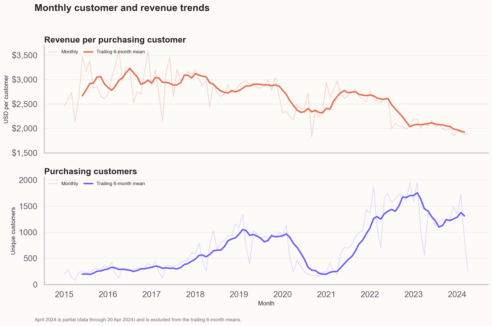
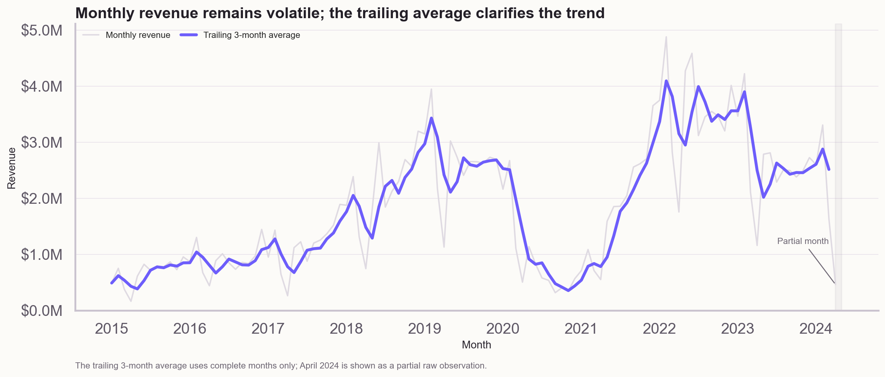
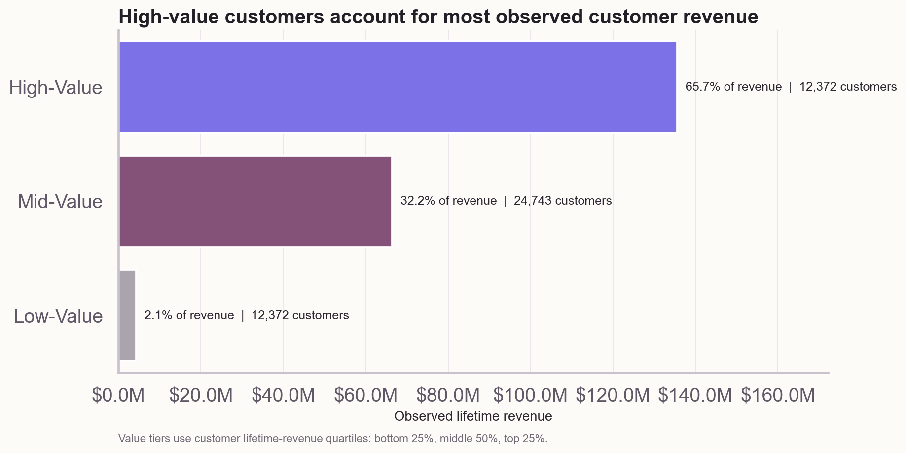
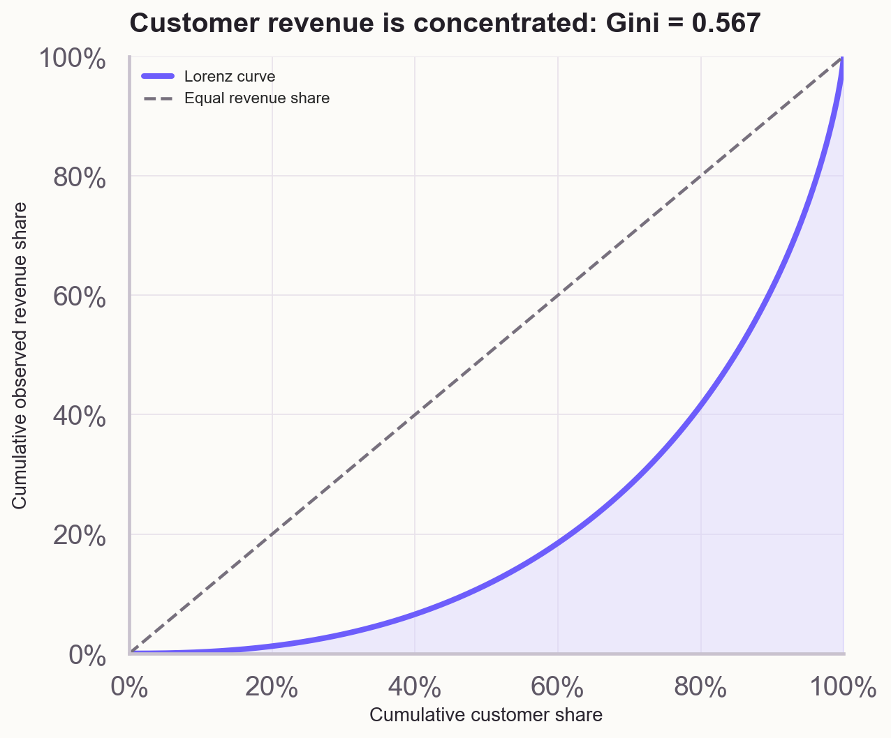
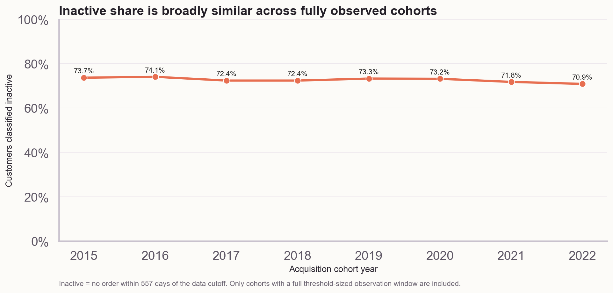
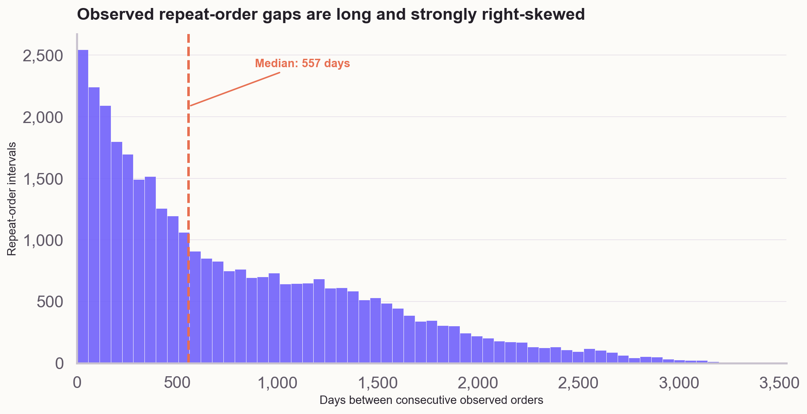
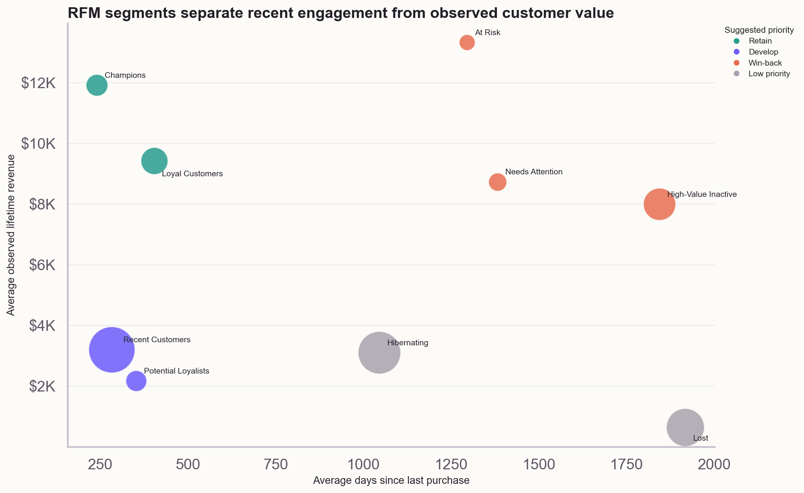
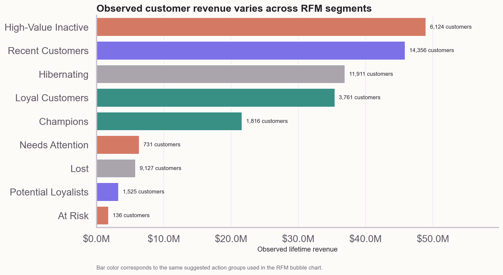
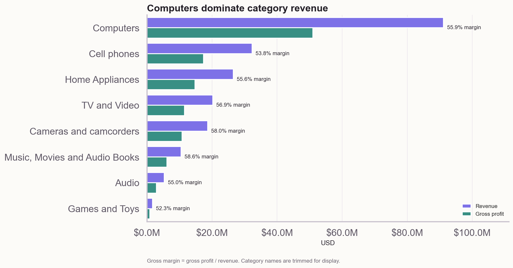
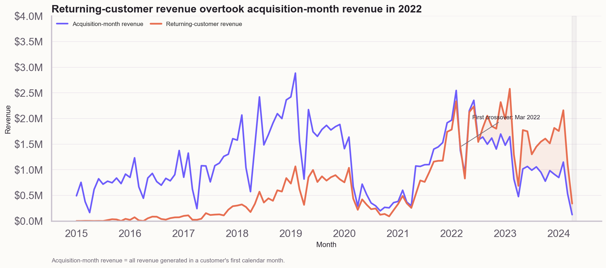

# Customer Analytics — SQL + Python

End-to-end customer analytics project on a Contoso 100K PostgreSQL dataset. The analysis covers **49,487 purchasing customers**, **83,130 orders**, and **199,873 sales lines** from **2015-01-01 to 2024-04-20**.

SQL defines the analytical grain and business metrics. Python loads those same `.sql` files for validation, visualization, and descriptive statistical analysis.

## Project Structure

```text
sql/
├── intermediate/
│   ├── 01_fact_orders.sql
│   ├── 02_customer_metrics.sql
│   └── 03_repeat_purchase_intervals.sql
├── marts/
│   ├── 01_monthly_revenue_customer_trends.sql
│   ├── 02_three_month_rolling_average.sql
│   ├── 03_customer_lifetime_revenue.sql
│   ├── 04_customer_inactivity_by_cohort.sql
│   ├── 05_rfm_segmentation.sql
│   ├── 06_product_analysis.sql
│   ├── 07_customer_revenue_mix.sql
│   └── 08_repeat_purchase_intervals.sql
└── validation/
    ├── 01_raw_data_audit.sql
    └── 02_order_grain_audit.sql

python/
├── notebooks/
│   ├── 01_data_validation.ipynb
│   ├── 02_visualizations.ipynb
│   └── 03_statistical_analysis.ipynb
└── src/
    ├── db.py
    └── sql_utils.py

docs/
└── DATA_SETUP.md

images/
requirements.txt
```

## Analytical Model

The raw `sales` table is line-item grain, so order metrics are not calculated directly from raw rows. The first analytical layer aggregates every order before customer metrics are built:

```sql
SELECT
    s.orderkey,
    s.customerkey,
    s.orderdate,
    SUM(s.quantity * s.netprice / s.exchangerate) AS order_revenue_usd,
    SUM(s.quantity) AS order_quantity
FROM sales s
GROUP BY
    s.orderkey,
    s.customerkey,
    s.orderdate;
```

**Core grain:** `fact_orders` = one row per `orderkey`.

This makes order counts, average order value, repeat-order intervals, and RFM Frequency consistent with their business definitions.

## Analysis

### 1. Monthly Customer and Revenue Trends

The average monthly number of purchasing customers increased from **239 in 2015** to **1277 in 2023** (5.3×). Over the same comparison, average monthly revenue per purchasing customer decreased by **26.5%**. This is a descriptive change in the observed customer/revenue mix; the dataset does not identify the business strategy that produced it.



### 2. Monthly Revenue Smoothing

A trailing three-month moving average is used to reduce month-to-month noise without using future observations.

```sql
AVG(monthly_revenue_usd) OVER (
    ORDER BY month
    ROWS BETWEEN 2 PRECEDING AND CURRENT ROW
) AS trailing_3m_avg_revenue_usd
```



### 3. Observed Customer Lifetime Revenue

Customers are split using Q1/Q3 thresholds of historical lifetime revenue. This is **observed lifetime revenue**, not a predictive CLV model.

| Segment | Customers | Avg lifetime revenue | Revenue share |
|---|---:|---:|---:|
| High-Value | 12,372 | $10,961 | 65.7% |
| Mid-Value | 24,743 | $2,682 | 32.2% |
| Low-Value | 12,372 | $347 | 2.1% |



### 4. Revenue Concentration

The Lorenz curve and Gini coefficient summarize concentration in customer revenue.

**Gini coefficient: 0.567.** The measure is used only to compare equality/concentration within this customer-revenue distribution; it is not compared directly with national income Gini values.



### 5. Customer Inactivity

The inactivity threshold is the **median observed interval between consecutive orders: 557 days** in this dataset. It is used as a pragmatic behavioral threshold and does not estimate a customer's probability of permanent churn.

| Observed interval percentile | Days |
|---|---:|
| 25th | 216 |
| Median | 557 |
| 75th | 1193 |

For cohorts old enough to have a full 557-day observation window, the share classified as inactive ranges from **70.9% to 74.1%** across 2015–2022 cohorts.



The purchase-gap distribution has an important survivorship limitation: a completed gap is observed only when another order occurs. It therefore does **not** estimate `P(customer never returns | inactivity duration)`.



### 6. RFM Segmentation

RFM uses:

- **Recency:** days since the last order,
- **Frequency:** number of actual `orderkey` values,
- **Monetary:** observed lifetime revenue.

Frequency is highly discrete, so its score uses transparent order-count bands (`1`, `2`, `3`, `4`, `5+`). Recency and Monetary use `PERCENT_RANK()` thresholds so identical metric values receive the same score rather than being split across arbitrary equal-sized buckets.

```sql
CASE
    WHEN frequency = 1 THEN 1
    WHEN frequency = 2 THEN 2
    WHEN frequency = 3 THEN 3
    WHEN frequency = 4 THEN 4
    ELSE 5
END AS f_score
```

The full customer-level RFM output is produced by `sql/marts/05_rfm_segmentation.sql`; the visualization notebook aggregates it to segment-level summaries.





### 7. Product Category Analysis

Category revenue and gross profit are calculated from sales lines, with gross margin weighted by revenue rather than averaging row-level percentages.

```sql
SUM(line_revenue_usd - line_cost_usd) * 100.0
/ NULLIF(SUM(line_revenue_usd), 0) AS gross_margin_pct
```

In this dataset, **Computers account for 44.2% of revenue**, while **Music, Movies & Audio Books has the highest gross margin at 58.6%**.



### 8. Acquisition-Month vs Returning-Customer Revenue

The monthly revenue mix separates:

- revenue generated during a customer's **first calendar month**, and
- revenue from customers acquired in an **earlier month**.

This intentionally answers a monthly acquisition-context question. It is not labelled as first-order vs repeat-order revenue. Returning-customer revenue first exceeded 50% in March 2022 and remained above 50% from August 2022 onward in the observed data.



## Key Findings

1. Average monthly purchasing-customer volume was about **5.3× higher in 2023 than in 2015**, while average monthly revenue per purchasing customer was **26.5% lower**.
2. The High-Value quartile generated **65.7% of observed customer revenue**; the Gini coefficient was **0.567**.
3. The median observed repeat-order interval was **557 days**. It is used as an inactivity heuristic, not a probabilistic churn boundary.
4. From August 2022 onward, monthly revenue from previously acquired customers remained above acquisition-month customer revenue in the observed period.
5. Product revenue is concentrated in Computers, while the highest category gross margin belongs to Music, Movies & Audio Books.

## Validation

The validation layer checks:

- raw NULL and invalid numeric values,
- uniqueness of customer/product keys,
- sales → customer/product foreign keys,
- one customer and one date per `orderkey`,
- one row per order in `fact_orders`,
- raw-to-order revenue and quantity reconciliation,
- RFM score ranges and tie handling,
- non-negative repeat-order intervals.

For the analyzed snapshot, the raw QA fingerprint is:

```text
sales rows             199,873
orders                   83,130
purchasing customers     49,487
customer dimension      104,990
order date range     2015-01-01 — 2024-04-20
```

## Limitations

- The data is synthetic/fictional Contoso retail data; findings are portfolio demonstrations, not claims about a real retailer.
- Historical lifetime revenue is descriptive and should not be interpreted as predicted CLV.
- Inactivity is a heuristic status. A survival model would be required to estimate return/churn probability over time.
- Repeat-order gaps are observed only for customers who return, creating survivorship bias in the gap distribution.
- RFM is a prioritization heuristic, not a causal or predictive model.
- 2024 is a partial year through April 20, so full-year comparisons use 2023 as the latest complete year.

## Reproducibility

See [`docs/DATA_SETUP.md`](docs/DATA_SETUP.md) for the dataset fingerprint, required raw columns, database connection settings, and execution order.

Python loads the SQL files directly through `python/src/sql_utils.py`, so analytical SQL is not duplicated inside notebooks.

## Tools

PostgreSQL, SQL, Python, pandas, NumPy, matplotlib, seaborn, SQLAlchemy, Jupyter.
